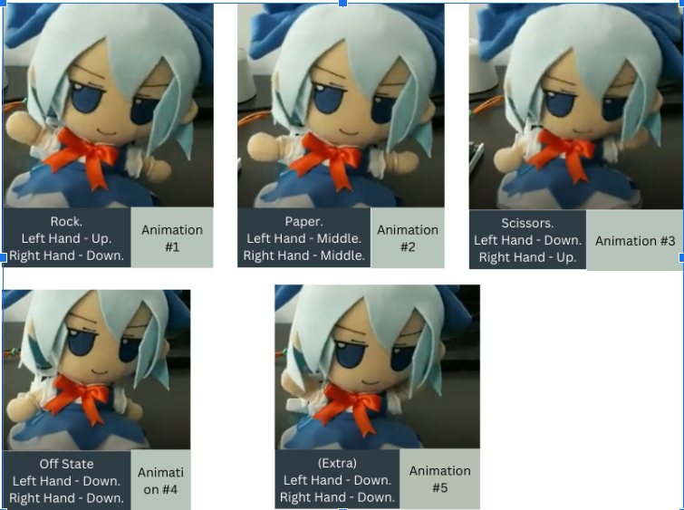
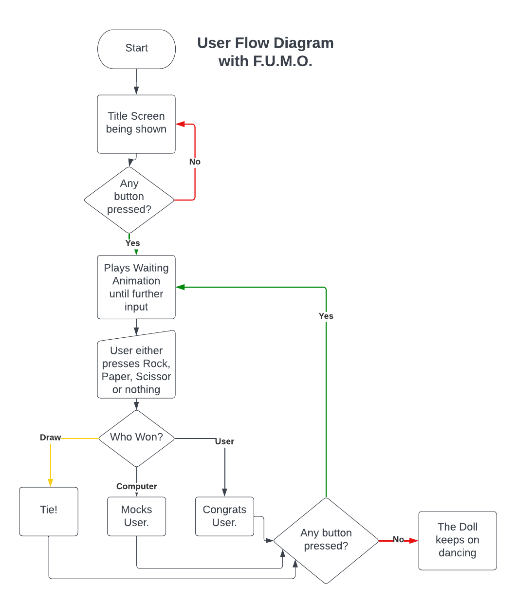
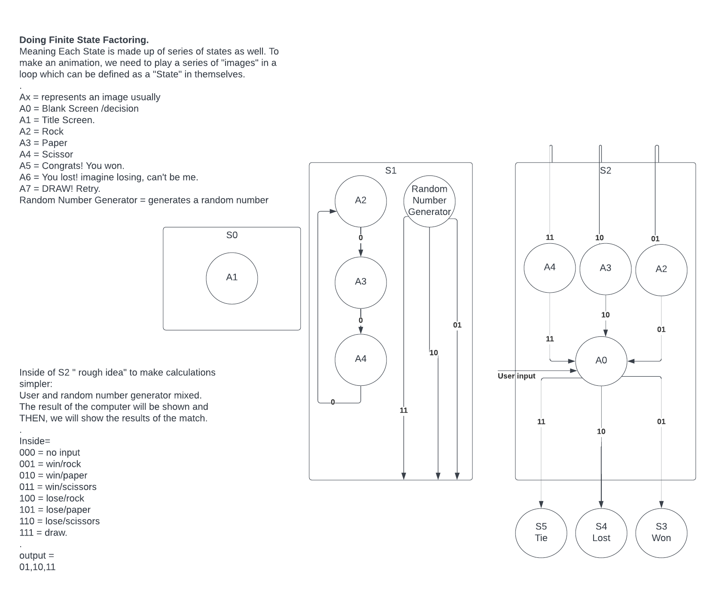
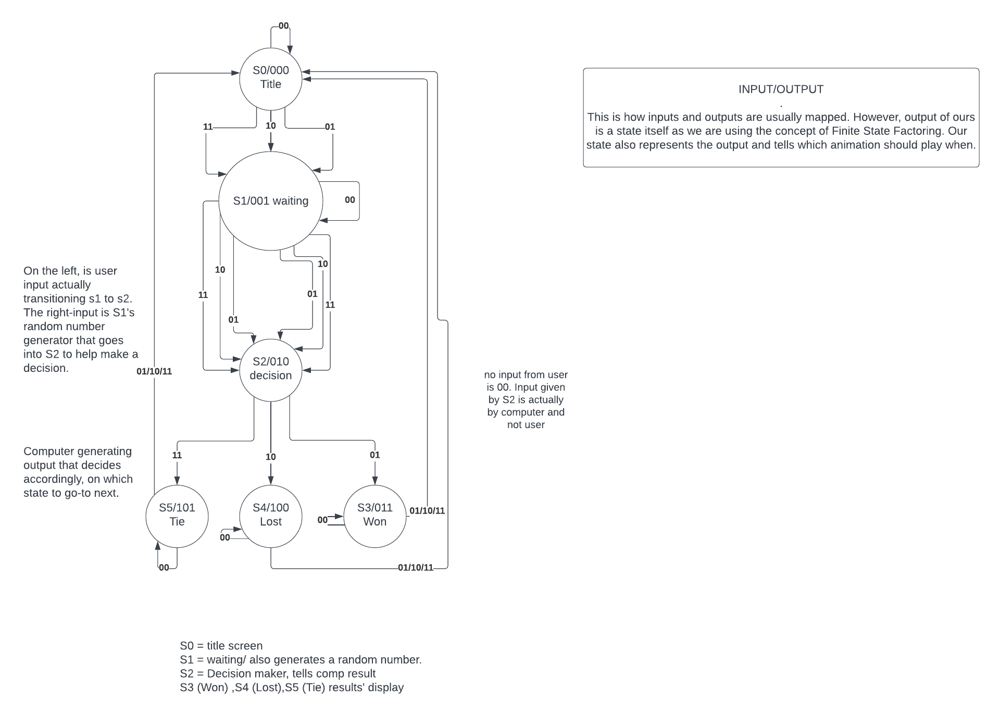

# Project X - The Playful R.P.S Machine and F.U.M.O!

## Introduction
Project X aims to create an interactive arcade machine for playing Rock-Paper-Scissors (R.P.S) against a computerized opponent represented by the Fanciful Ultra-reliable Machinating Obsequious (F.U.M.O) doll. The project combines hardware interfacing, software programming, and mechanical design to deliver a unique gaming experience. Please read the report for in-depth explanation and documentation of each step.

  

## User Interaction
Upon powering up, the player is greeted with a title screen. The game cycles through rock, paper, and scissors animations until a player input is received. The player's choice is then compared with the computer's, and the outcome is displayed on a VGA monitor alongside the F.U.M.O doll's reaction.

## Input Design
Four push buttons interface with an FPGA Basys-3 board to serve as inputs for Rock, Paper, Scissors, and Reset. The input logic utilizes pull-down resistors and connects through the "JC" Pmod connector.

## Output Design
The output is twofold: visual feedback through a VGA monitor and physical feedback through the F.U.M.O doll's movements. The VGA display is divided into a 20x15 grid, with each cell being 32x32 pixels. The doll's movements are controlled by servos, which are programmed to reflect the game's status, such as celebrating a win or sulking in defeat.

  

## Implementation Details
- **VGA Operation**: Implemented using a pixel generator module and a VGA top module to manage screen displays based on the game state.
- **FPGA Servo Operation**: Utilizes SG90 servos for doll movement, controlled via PWM signals from the FPGA.
- **Control Logic**: The game's state transitions are managed by a finite state machine (FSM), with a separate FSM for VGA display management.

## Challenges and Reflections
The project presented a steep learning curve, particularly in understanding sequential logic and FSMs. The team gained valuable insights into Verilog programming and the intricacies of parallel and sequential programming.
Following are our State Diagrams

  

  

  

## Code Repository
- Main Project: [Google Docs Link](https://docs.google.com/document/d/1mMNt7o-MtOfh-CjJVZQpDK4PZY1l2mabpcyGlY5NrsM/edit?usp=sharing)
- VGA Module: [SharePoint Link](https://habibuniversity-my.sharepoint.com/:u:/g/personal/sh07554_st_habib_edu_pk/EbCuKKqbde9Bm5ovl7yC1DwBg1aKdRyJZMv9LzhKebBAeA?e=5baBAZ)
- Servo Operation Code: [Google Docs Link](https://docs.google.com/document/d/1ai2WHQsPWw-76Ts1HpeX_niGanEwe_eDRgd4QtKREF4/edit?usp=sharing)

## Acknowledgements
A heartfelt thanks to everyone involved in bringing this ambitious project to life. The team's diverse strengths and personalities contributed to the project's success and made it a memorable experience. One of the main inspiration of this project was this youtube [video](https://www.youtube.com/watch?v=Wpd5-Yd4p3M)

---

**Note**: This README.md is a condensed version of the original project report. For detailed information, please refer to the provided links and references.
